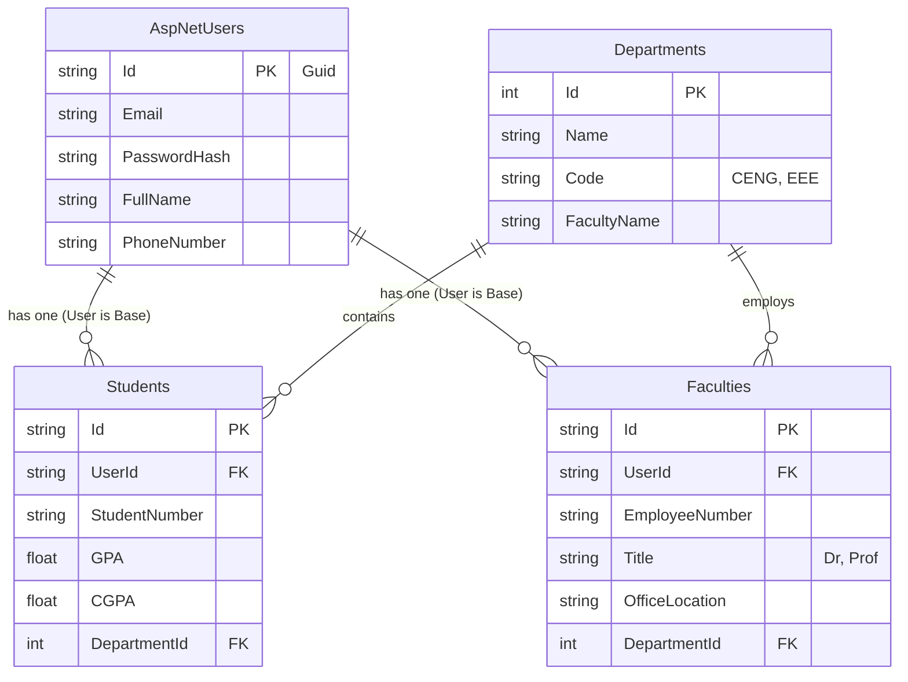

# 🗄️ Database Schema - Part 1

## ER Diagram

## Tablo Açıklamaları

### 1. AspNetUsers (Taban Kullanıcı Tablosu)
Identity Framework tarafından yönetilen ana kullanıcı tablosudur. Tüm kullanıcıların (Öğrenci, Akademisyen, Admin) ortak bilgileri (Email, Şifre, İsim) burada tutulur.

### 2. Students (Öğrenciler)
Öğrencilere özgü bilgilerin tutulduğu tablodur. `UserId` ile `AspNetUsers` tablosuna 1-1 bağlıdır.
*   **StudentNumber**: Öğrenci numarası.
*   **GPA/CGPA**: Not ortalamaları.
*   **DepartmentId**: Öğrencinin bölümü.

### 3. Faculties (Akademisyenler)
Öğretim üyelerine özgü bilgilerin tutulduğu tablodur. `UserId` ile `AspNetUsers` tablosuna 1-1 bağlıdır.
*   **Title**: Unvan (Dr., Prof. vb.)
*   **OfficeLocation**: Ofis bilgisi.

### 4. Departments (Bölümler)
Üniversitedeki bölümlerin listesidir. Hem öğrenciler hem de akademisyenler bir bölüme bağlıdır.
*   **Code**: Bölüm kısa kodu (örn: CENG).
*   **FacultyName**: Bölümün bağlı olduğu fakülte (örn: Mühendislik Fakültesi).
