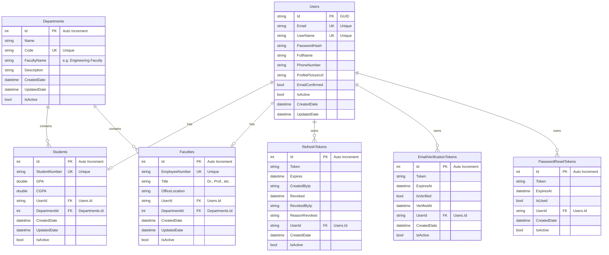

# 🗄️ Smart Campus - Veritabanı Şeması (Part 1)

## 📊 ER Diyagramı



---

## 📋 Tablo Açıklamaları

### 1. Users (AspNetUsers)

ASP.NET Identity tablosu üzerine özelleştirilmiş kullanıcı tablosu.

| Kolon | Tip | Null | Açıklama |
|:------|:----|:-----|:---------|
| `Id` | `varchar(255)` | ❌ | Primary Key (GUID) |
| `Email` | `varchar(256)` | ❌ | Kullanıcı e-posta adresi (Unique) |
| `UserName` | `varchar(256)` | ❌ | Kullanıcı adı (Unique) |
| `NormalizedEmail` | `varchar(256)` | ✅ | Normalized e-posta (arama için) |
| `NormalizedUserName` | `varchar(256)` | ✅ | Normalized kullanıcı adı |
| `PasswordHash` | `longtext` | ✅ | Hashlenmiş şifre |
| `FullName` | `varchar(100)` | ❌ | Ad Soyad |
| `PhoneNumber` | `varchar(20)` | ✅ | Telefon numarası |
| `ProfilePictureUrl` | `varchar(500)` | ✅ | Profil fotoğrafı URL'i |
| `EmailConfirmed` | `tinyint(1)` | ❌ | E-posta doğrulandı mı |
| `IsActive` | `tinyint(1)` | ❌ | Hesap aktif mi (Soft Delete) |
| `CreatedDate` | `datetime` | ❌ | Kayıt tarihi |
| `UpdatedDate` | `datetime` | ✅ | Son güncelleme tarihi |
| `SecurityStamp` | `longtext` | ✅ | Güvenlik damgası |
| `ConcurrencyStamp` | `longtext` | ✅ | Eşzamanlılık kontrolü |

---

### 2. Students

Öğrenci detay bilgilerini içerir.

| Kolon | Tip | Null | Açıklama |
|:------|:----|:-----|:---------|
| `Id` | `int` | ❌ | Primary Key (Auto Increment) |
| `StudentNumber` | `varchar(20)` | ❌ | Öğrenci numarası (Unique) |
| `GPA` | `double` | ❌ | Dönem not ortalaması |
| `CGPA` | `double` | ❌ | Genel not ortalaması |
| `UserId` | `varchar(255)` | ❌ | Foreign Key → Users.Id |
| `DepartmentId` | `int` | ❌ | Foreign Key → Departments.Id |
| `CreatedDate` | `datetime` | ❌ | Kayıt tarihi |
| `UpdatedDate` | `datetime` | ✅ | Son güncelleme tarihi |
| `IsActive` | `tinyint(1)` | ❌ | Kayıt aktif mi |

---

### 3. Faculties

Akademisyen detay bilgilerini içerir.

| Kolon | Tip | Null | Açıklama |
|:------|:----|:-----|:---------|
| `Id` | `int` | ❌ | Primary Key (Auto Increment) |
| `EmployeeNumber` | `varchar(20)` | ❌ | Sicil numarası (Unique) |
| `Title` | `varchar(50)` | ❌ | Unvan (Dr., Prof., Doç. vb.) |
| `OfficeLocation` | `varchar(100)` | ✅ | Ofis konumu (A-101 vb.) |
| `UserId` | `varchar(255)` | ❌ | Foreign Key → Users.Id |
| `DepartmentId` | `int` | ❌ | Foreign Key → Departments.Id |
| `CreatedDate` | `datetime` | ❌ | Kayıt tarihi |
| `UpdatedDate` | `datetime` | ✅ | Son güncelleme tarihi |
| `IsActive` | `tinyint(1)` | ❌ | Kayıt aktif mi |

---

### 4. Departments

Bölüm bilgilerini içerir.

| Kolon | Tip | Null | Açıklama |
|:------|:----|:-----|:---------|
| `Id` | `int` | ❌ | Primary Key (Auto Increment) |
| `Name` | `varchar(100)` | ❌ | Bölüm adı |
| `Code` | `varchar(10)` | ❌ | Bölüm kodu (CE, SE vb.) |
| `FacultyName` | `varchar(100)` | ✅ | Fakülte adı |
| `Description` | `text` | ✅ | Bölüm açıklaması |
| `CreatedDate` | `datetime` | ❌ | Kayıt tarihi |
| `UpdatedDate` | `datetime` | ✅ | Son güncelleme tarihi |
| `IsActive` | `tinyint(1)` | ❌ | Kayıt aktif mi |

---

### 5. RefreshTokens

JWT refresh token kayıtlarını tutar.

| Kolon | Tip | Null | Açıklama |
|:------|:----|:-----|:---------|
| `Id` | `int` | ❌ | Primary Key (Auto Increment) |
| `Token` | `varchar(500)` | ❌ | Refresh token değeri |
| `Expires` | `datetime` | ❌ | Son geçerlilik tarihi |
| `CreatedByIp` | `varchar(50)` | ✅ | Oluşturulduğu IP adresi |
| `Revoked` | `datetime` | ✅ | İptal tarihi |
| `RevokedByIp` | `varchar(50)` | ✅ | İptal eden IP adresi |
| `ReasonRevoked` | `varchar(200)` | ✅ | İptal sebebi |
| `UserId` | `varchar(255)` | ❌ | Foreign Key → Users.Id |
| `CreatedDate` | `datetime` | ❌ | Kayıt tarihi |
| `IsActive` | `tinyint(1)` | ❌ | Kayıt aktif mi |

---

### 6. EmailVerificationTokens

E-posta doğrulama tokenlarını tutar.

| Kolon | Tip | Null | Açıklama |
|:------|:----|:-----|:---------|
| `Id` | `int` | ❌ | Primary Key (Auto Increment) |
| `Token` | `varchar(500)` | ❌ | Doğrulama token değeri |
| `ExpiresAt` | `datetime` | ❌ | Son geçerlilik tarihi |
| `IsVerified` | `tinyint(1)` | ❌ | Doğrulandı mı |
| `VerifiedAt` | `datetime` | ✅ | Doğrulama tarihi |
| `UserId` | `varchar(255)` | ❌ | Foreign Key → Users.Id |
| `CreatedDate` | `datetime` | ❌ | Kayıt tarihi |
| `IsActive` | `tinyint(1)` | ❌ | Kayıt aktif mi |

---

### 7. PasswordResetTokens

Şifre sıfırlama tokenlarını tutar.

| Kolon | Tip | Null | Açıklama |
|:------|:----|:-----|:---------|
| `Id` | `int` | ❌ | Primary Key (Auto Increment) |
| `Token` | `varchar(500)` | ❌ | Şifre sıfırlama token değeri |
| `ExpiresAt` | `datetime` | ❌ | Son geçerlilik tarihi (24 saat) |
| `IsUsed` | `tinyint(1)` | ❌ | Kullanıldı mı |
| `UserId` | `varchar(255)` | ❌ | Foreign Key → Users.Id |
| `CreatedDate` | `datetime` | ❌ | Kayıt tarihi |
| `IsActive` | `tinyint(1)` | ❌ | Kayıt aktif mi |

---

## 🔗 İlişkiler (Foreign Keys)

| Tablo | Kolon | Referans | İlişki Tipi | OnDelete |
|:------|:------|:---------|:------------|:---------|
| `Students` | `UserId` | `Users.Id` | One-to-One | CASCADE |
| `Students` | `DepartmentId` | `Departments.Id` | Many-to-One | RESTRICT |
| `Faculties` | `UserId` | `Users.Id` | One-to-One | CASCADE |
| `Faculties` | `DepartmentId` | `Departments.Id` | Many-to-One | RESTRICT |
| `RefreshTokens` | `UserId` | `Users.Id` | Many-to-One | CASCADE |
| `EmailVerificationTokens` | `UserId` | `Users.Id` | Many-to-One | CASCADE |
| `PasswordResetTokens` | `UserId` | `Users.Id` | Many-to-One | CASCADE |

### İlişki Açıklamaları

```
Users ──────────── Students          (1:1) Bir kullanıcı bir öğrenci olabilir
Users ──────────── Faculties         (1:1) Bir kullanıcı bir akademisyen olabilir
Departments ────── Students          (1:N) Bir bölümde birçok öğrenci olabilir
Departments ────── Faculties         (1:N) Bir bölümde birçok akademisyen olabilir
Users ──────────── RefreshTokens     (1:N) Bir kullanıcının birden fazla token'ı olabilir
Users ──────────── EmailVerificationTokens (1:N) 
Users ──────────── PasswordResetTokens     (1:N)
```

---

## 📇 Indexes

### Primary Key Indexes

| Tablo | Index Adı | Kolon(lar) |
|:------|:----------|:-----------|
| `Users` | `PK_AspNetUsers` | `Id` |
| `Students` | `PK_Students` | `Id` |
| `Faculties` | `PK_Faculties` | `Id` |
| `Departments` | `PK_Departments` | `Id` |
| `RefreshTokens` | `PK_RefreshTokens` | `Id` |
| `EmailVerificationTokens` | `PK_EmailVerificationTokens` | `Id` |
| `PasswordResetTokens` | `PK_PasswordResetTokens` | `Id` |

### Unique Indexes

| Tablo | Index Adı | Kolon(lar) | Açıklama |
|:------|:----------|:-----------|:---------|
| `Users` | `IX_Users_Email` | `Email` | E-posta tekil olmalı |
| `Users` | `IX_Users_UserName` | `UserName` | Kullanıcı adı tekil olmalı |
| `Students` | `IX_Students_StudentNumber` | `StudentNumber` | Öğrenci no tekil |
| `Students` | `IX_Students_UserId` | `UserId` | 1:1 ilişki garantisi |
| `Faculties` | `IX_Faculties_EmployeeNumber` | `EmployeeNumber` | Sicil no tekil |
| `Faculties` | `IX_Faculties_UserId` | `UserId` | 1:1 ilişki garantisi |
| `Departments` | `IX_Departments_Code` | `Code` | Bölüm kodu tekil |

### Foreign Key Indexes

| Tablo | Index Adı | Kolon(lar) |
|:------|:----------|:-----------|
| `Students` | `IX_Students_DepartmentId` | `DepartmentId` |
| `Faculties` | `IX_Faculties_DepartmentId` | `DepartmentId` |
| `RefreshTokens` | `IX_RefreshTokens_UserId` | `UserId` |
| `EmailVerificationTokens` | `IX_EmailVerificationTokens_UserId` | `UserId` |
| `PasswordResetTokens` | `IX_PasswordResetTokens_UserId` | `UserId` |

### Performance Indexes

| Tablo | Index Adı | Kolon(lar) | Açıklama |
|:------|:----------|:-----------|:---------|
| `Users` | `IX_Users_IsActive` | `IsActive` | Aktif kullanıcı sorguları |
| `RefreshTokens` | `IX_RefreshTokens_Token` | `Token` | Token lookup hızlandırma |
| `RefreshTokens` | `IX_RefreshTokens_Expires` | `Expires` | Süresi dolmuş token temizliği |

---

## 🔄 Soft Delete Stratejisi

Tüm tablolarda `IsActive` alanı kullanılarak **Soft Delete** uygulanmaktadır:

- Silme işlemi: `IsActive = false`
- Aktif kayıtlar: `WHERE IsActive = true`
- Silinen kullanıcının tüm refresh token'ları iptal edilir

---

## 📝 ASP.NET Identity Tabloları

Aşağıdaki tablolar ASP.NET Identity tarafından otomatik yönetilir:

| Tablo | Açıklama |
|:------|:---------|
| `AspNetRoles` | Rol tanımları (Admin, Student, Faculty) |
| `AspNetUserRoles` | Kullanıcı-Rol ilişkileri |
| `AspNetUserClaims` | Kullanıcı claim'leri |
| `AspNetUserLogins` | Harici login provider'lar |
| `AspNetUserTokens` | Kullanıcı tokenları |
| `AspNetRoleClaims` | Rol claim'leri |
