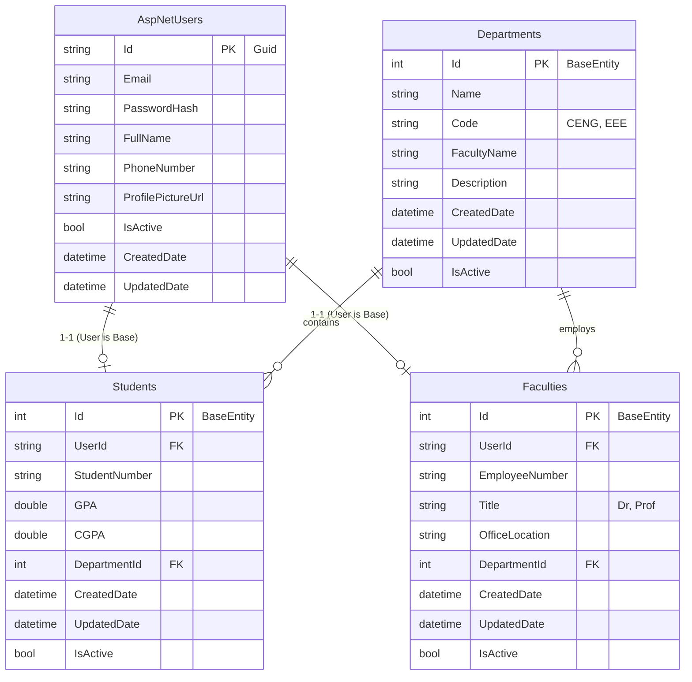

# 🗄️ Database Schema - Part 1

## ER Diagram

## Tablo Açıklamaları

### 1. AspNetUsers (Taban Kullanıcı Tablosu)
Identity Framework tarafından yönetilen ana kullanıcı tablosudur. `IdentityUser` sınıfından türetilmiştir.

| Alan | Tip | Açıklama |
|:-----|:----|:---------|
| `Id` | `string (Guid)` | Birincil anahtar |
| `Email` | `string` | Kullanıcı email adresi |
| `FullName` | `string` | Ad Soyad |
| `PhoneNumber` | `string?` | Telefon numarası |
| `ProfilePictureUrl` | `string?` | Profil fotoğrafı yolu |
| `IsActive` | `bool` | Hesap aktif mi? (default: true) |
| `CreatedDate` | `DateTime` | Oluşturulma tarihi |
| `UpdatedDate` | `DateTime?` | Son güncelleme tarihi |

### 2. Students (Öğrenciler)
Öğrencilere özgü bilgilerin tutulduğu tablodur. `BaseEntity` sınıfından türetilmiştir ve `UserId` ile `AspNetUsers` tablosuna 1-1 bağlıdır.

| Alan | Tip | Açıklama |
|:-----|:----|:---------|
| `Id` | `int` | Birincil anahtar (BaseEntity) |
| `StudentNumber` | `string` | Öğrenci numarası |
| `GPA` | `double` | Dönem not ortalaması |
| `CGPA` | `double` | Genel not ortalaması |
| `UserId` | `string (FK)` | AspNetUsers tablosuna referans |
| `DepartmentId` | `int (FK)` | Departments tablosuna referans |

### 3. Faculties (Akademisyenler)
Öğretim üyelerine özgü bilgilerin tutulduğu tablodur. `BaseEntity` sınıfından türetilmiştir.

| Alan | Tip | Açıklama |
|:-----|:----|:---------|
| `Id` | `int` | Birincil anahtar (BaseEntity) |
| `EmployeeNumber` | `string` | Sicil numarası |
| `Title` | `string` | Unvan (Dr., Prof. vb.) |
| `OfficeLocation` | `string?` | Ofis bilgisi |
| `UserId` | `string (FK)` | AspNetUsers tablosuna referans |
| `DepartmentId` | `int (FK)` | Departments tablosuna referans |

### 4. Departments (Bölümler)
Üniversitedeki bölümlerin listesidir. `BaseEntity` sınıfından türetilmiştir.

| Alan | Tip | Açıklama |
|:-----|:----|:---------|
| `Id` | `int` | Birincil anahtar (BaseEntity) |
| `Name` | `string` | Bölüm adı |
| `Code` | `string` | Bölüm kısa kodu (örn: CENG) |
| `FacultyName` | `string?` | Bağlı olduğu fakülte |
| `Description` | `string?` | Bölüm açıklaması |

### 5. BaseEntity (Ortak Soyut Sınıf)
Tüm entity'lerin ortak alanlarını içeren soyut sınıftır.

| Alan | Tip | Açıklama |
|:-----|:----|:---------|
| `Id` | `int` | Birincil anahtar |
| `CreatedDate` | `DateTime` | Oluşturulma tarihi (default: UTC Now) |
| `UpdatedDate` | `DateTime?` | Son güncelleme tarihi |
| `IsActive` | `bool` | Kayıt aktif mi? (default: true) |
