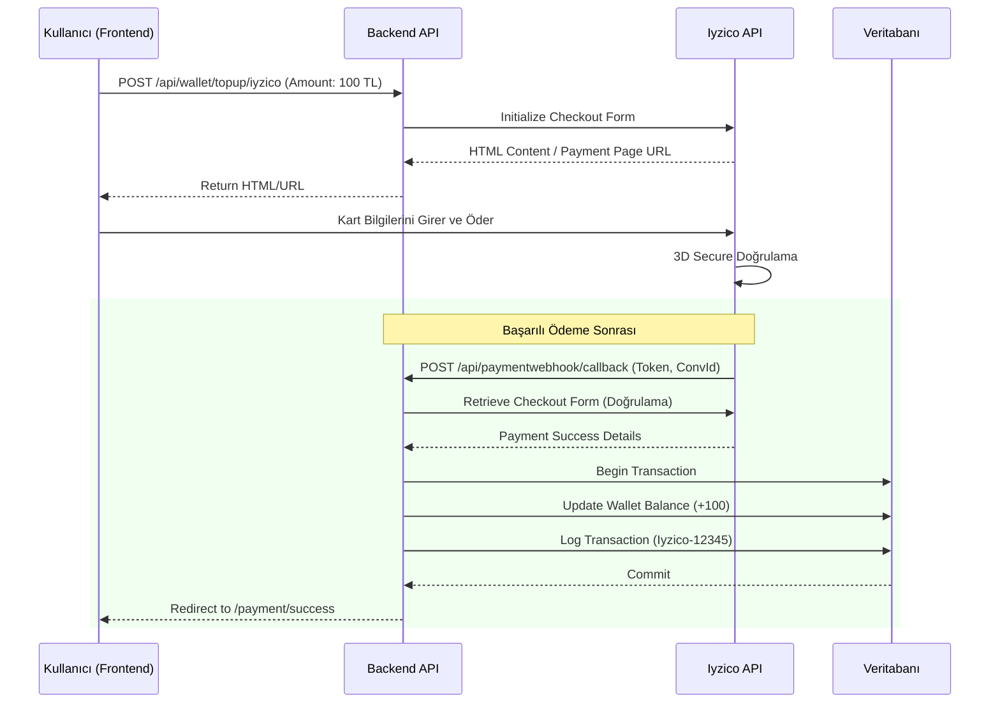

# 💳 Ödeme Entegrasyonu Kılavuzu (Part 3)

Bu doküman, SmartCampus projesindeki ödeme sisteminin entegrasyon detaylarını, akış şemalarını ve yapılandırma adımlarını içerir.

## 1. Genel Bakış
Sistemde **Iyzico Ödeme Altyapısı** kullanılmıştır. Ödeme akışı, kullanıcının kart bilgilerini girdiği veya Iyzico Ortak Ödeme Sayfasına yönlendirildiği, ardından ödeme sonucunun **Webhook/Callback** mekanizması ile sunucuya bildirildiği güvenli bir mimariye sahiptir.

### 🔑 Kullanılan Teknolojiler
- **Provider:** Iyzico (Sandbox/Production)
- **Kütüphane:** Iyzipay (.NET SDK)
- **Akış:** 3D Secure / Checkout Form
- **Veri Tutarlılığı:** ACID Transactions (Entity Framework Core)

---

## 2. Entegrasyon Akış Şeması



---

## 3. Webhook Yapısı
Ödeme işlemi tamamlandığında Iyzico, belirtilen `CallbackUrl` adresine bir POST isteği gönderir.

- **Endpoint:** `/api/paymentwebhook/callback`
- **Method:** `POST`
- **Parametreler:**
  - `token`: Ödeme oturumunu temsil eden tek seferlik anahtar.
  - `conversationId`: İşlem için oluşturulan unique ID.

### ACID Transaction Güvencesi
Webhook endpoint'i içerisinde bakiye güncelleme işlemi `IWalletService.AddBalanceAsync` metodu ile yapılır. Bu metot:
1.  Veritabanı Transaction'ı başlatır (`BeginTransaction`).
2.  Cüzdan bakiyesini artırır.
3.  İşlem geçmişine (Transactions) kaydı ekler.
4.  Hata olmazsa `Commit` eder, hata olursa `Rollback` yaparak veri tutarlılığını sağlar.

---

## 4. Kurulum ve Yapılandırma

`appsettings.json` dosyasında aşağıdaki ayarların yapılması gerekmektedir:

```json
"IyzicoSettings": {
    "ApiKey": "sandbox-...",       // Iyzico panelinden alınacak
    "SecretKey": "sandbox-...",    // Iyzico panelinden alınacak
    "BaseUrl": "https://sandbox-api.iyzipay.com" // Prod: https://api.iyzipay.com
}
```

## 5. Test Kartları (Sandbox)

| Kart Tipi | Kart Numarası | SKT | CVC |
|-----------|---------------|-----|-----|
| Visa | 4652 0000 0000 0000 | 12/30 | 123 |
| Master | 5115 0000 0000 0000 | 12/30 | 123 |
| Amex | 3755 0000 0000 0000 | 12/30 | 123 |

> **Not:** Sandbox ortamında bakiye limiti olmadığı için her tutarı test edebilirsiniz.
