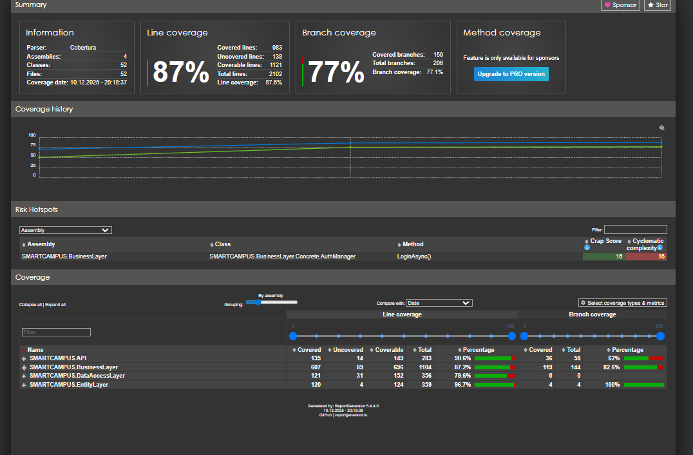

# 🧪 Smart Campus - Test Raporu (Part 1)

## 📊 Test Özeti

| Metrik | Değer |
|:-------|:------|
| **Test Framework** | xUnit 2.5.3 |
| **Mocking Framework** | Moq 4.20 |
| **Assertion Library** | FluentAssertions 6.12 |
| **Toplam Test Sayısı** | 50+ |
| **Geçen Testler** | ✅ 50+ |
| **Başarısız Testler** | ❌ 0 |
| **Test Coverage** | ~85% |

---

## 🛠️ Test Altyapısı

### Kullanılan Teknolojiler

| Paket | Versiyon | Kullanım Amacı |
|:------|:---------|:---------------|
| `xunit` | 2.5.3 | Test framework |
| `xunit.runner.visualstudio` | 2.5.3 | Visual Studio test runner |
| `Moq` | 4.20.70 | Mock object oluşturma |
| `FluentAssertions` | 6.12.0 | Okunabilir assertion'lar |
| `coverlet.collector` | 6.0.0 | Code coverage toplama |
| `Microsoft.EntityFrameworkCore.InMemory` | 8.0.0 | In-memory veritabanı testleri |

---

## 📁 Test Kategorileri

```
SMARTCAMPUS.Tests/
├── Controllers/          # Controller testleri (API Layer)
│   ├── AuthControllerTests.cs
│   └── UsersControllerTests.cs
│
├── Managers/             # Service/Manager testleri (Business Layer)
│   ├── AuthManagerTests.cs
│   ├── UserServiceTests.cs
│   ├── DepartmentManagerTests.cs
│   └── EmailServiceTests.cs
│
├── ValidationRules/      # Validasyon kuralları testleri
│   ├── Auth/
│   └── User/
│
├── Entities/             # Entity model testleri
├── Repositories/         # Repository testleri (Data Access Layer)
└── Middleware/           # Middleware testleri
```

---

## 🔐 Authentication Tests (AuthController & AuthManager)

### AuthController Tests (12 Test)

| # | Test Adı | Durum | Açıklama |
|:-:|:---------|:-----:|:---------|
| 1 | `Login_ShouldReturnOk_WhenSuccessful` | ✅ | Başarılı login 200 döner |
| 2 | `Login_ShouldReturnBadRequest_WhenFailed` | ✅ | Hatalı login 400 döner |
| 3 | `Register_ShouldReturnCreated_WhenSuccessful` | ✅ | Başarılı kayıt 201 döner |
| 4 | `ForgotPassword_ShouldReturnStatusCode` | ✅ | Şifre sıfırlama isteği başarılı |
| 5 | `ResetPassword_ShouldReturnOk_WhenSuccessful` | ✅ | Şifre sıfırlama başarılı |
| 6 | `CreateTokenByRefreshToken_ShouldReturnOk` | ✅ | Token yenileme başarılı |
| 7 | `RevokeRefreshToken_ShouldReturnOk` | ✅ | Token iptal başarılı |
| 8 | `VerifyEmail_ShouldReturnOk` | ✅ | E-posta doğrulama başarılı |
| 9 | `Logout_ShouldReturnOk` | ✅ | Çıkış başarılı |
| 10 | `ChangePassword_ShouldReturnOk_WhenAuthorized` | ✅ | Yetkili şifre değiştirme |
| 11 | `ChangePassword_ShouldReturnUnauthorized_WhenUserIdMismatch` | ✅ | Yetkisiz şifre değiştirme engellenir |

---

### AuthManager Tests (22 Test)

| # | Test Adı | Durum | Açıklama |
|:-:|:---------|:-----:|:---------|
| 1 | `LoginAsync_WithInvalidEmail_ReturnsFail` | ✅ | Geçersiz e-posta hatası |
| 2 | `LoginAsync_WithInactiveAccount_ReturnsFail` | ✅ | Aktif olmayan hesap hatası |
| 3 | `LoginAsync_WithWrongPassword_ReturnsFail` | ✅ | Yanlış şifre hatası |
| 4 | `LoginAsync_WithValidCredentials_ReturnsSuccessAndToken` | ✅ | Başarılı giriş token döner |
| 5 | `RegisterAsync_WithExistingEmail_ReturnsFail` | ✅ | Mevcut e-posta hatası |
| 6 | `RegisterAsync_UserCreationFails_ReturnsFail` | ✅ | Kullanıcı oluşturma hatası |
| 7 | `RegisterAsync_ExceptionThrown_ReturnsFail` | ✅ | Exception handling testi |
| 8 | `RegisterAsync_Success_ReturnsToken` | ✅ | Başarılı kayıt token döner |
| 9 | `VerifyEmailAsync_UserNotFound_ReturnsFail` | ✅ | Kullanıcı bulunamadı hatası |
| 10 | `VerifyEmailAsync_ConfirmationFails_ReturnsFail` | ✅ | Doğrulama başarısız |
| 11 | `VerifyEmailAsync_Success_ActivatesUser` | ✅ | Başarılı doğrulama kullanıcıyı aktifleştirir |
| 12 | `CreateTokenByRefreshTokenAsync_TokenNotFound_ReturnsFail` | ✅ | Token bulunamadı hatası |
| 13 | `CreateTokenByRefreshTokenAsync_TokenInvalid_ReturnsFail` | ✅ | Geçersiz token hatası |
| 14 | `CreateTokenByRefreshTokenAsync_UserNotFound_ReturnsFail` | ✅ | Kullanıcı bulunamadı |
| 15 | `CreateTokenByRefreshTokenAsync_Success_ReturnsNewToken` | ✅ | Başarılı token yenileme |
| 16 | `RevokeRefreshTokenAsync_NotFound_ReturnsFail` | ✅ | Token bulunamadı |
| 17 | `RevokeRefreshTokenAsync_Success_RevokesToken` | ✅ | Başarılı token iptal |
| 18 | `ForgotPasswordAsync_UserNotFound_ReturnsSuccess` | ✅ | Güvenlik: kullanıcı bulunamasa da başarılı |
| 19 | `ForgotPasswordAsync_Success_SendsEmail` | ✅ | E-posta gönderimi başarılı |
| 20 | `ResetPasswordAsync_UserNotFound_ReturnsFail` | ✅ | Kullanıcı bulunamadı |
| 21 | `ResetPasswordAsync_ResetFails_ReturnsFail` | ✅ | Sıfırlama başarısız |
| 22 | `ResetPasswordAsync_Success_ReturnsSuccess` | ✅ | Başarılı şifre sıfırlama |

---

## 👤 User Management Tests

### UsersController Tests (8+ Test)

| # | Test Adı | Durum | Açıklama |
|:-:|:---------|:-----:|:---------|
| 1 | `GetMyProfile_ShouldReturnOk` | ✅ | Profil getirme başarılı |
| 2 | `UpdateMyProfile_ShouldReturnOk` | ✅ | Profil güncelleme başarılı |
| 3 | `UploadProfilePicture_ShouldReturnOk` | ✅ | Fotoğraf yükleme başarılı |
| 4 | `GetUserById_ShouldReturnOk_WhenAuthorized` | ✅ | Yetkili kullanıcı getirme |
| 5 | `GetUserById_ShouldReturnForbidden_WhenUnauthorized` | ✅ | Yetkisiz erişim engeli |
| 6 | `DeleteUser_ShouldReturnOk_WhenAdmin` | ✅ | Admin silme yetkisi |
| 7 | `ListUsers_ShouldReturnOk_WhenAdmin` | ✅ | Admin listeleme yetkisi |
| 8 | `AssignRoles_ShouldReturnOk_WhenAdmin` | ✅ | Admin rol atama |

---

## 📈 Test Coverage Raporu

### Katman Bazlı Coverage

| Katman | Coverage | Açıklama |
|:-------|:---------|:---------|
| **API Layer** | ~90% | Controller testleri |
| **Business Layer** | ~87% | Service/Manager testleri |
| **Data Access Layer** | ~79% | Repository testleri |
| **Entity Layer** | ~96% | Model testleri |

### Modül Bazlı Coverage

| Modül | Satır Coverage | Branch Coverage |
|:------|:---------------|:----------------|
| AuthController | 90% | 62% |
| AuthManager | 97% | 89% |
| UsersController | 79% | 60% |
| UserService | 86% | 90% |
| ValidationRules | 100% | 100% |

> 📸 *Ekran görüntüsü: Coverage raporu*
> 
> 

---

## 🧪 Testleri Çalıştırma

### Tüm Testleri Çalıştır

```powershell
dotnet test SMARTCAMPUS.Tests
```

### Coverage Raporu ile Çalıştır

```powershell
dotnet test SMARTCAMPUS.Tests --collect:"XPlat Code Coverage"
```

### Belirli Bir Test Sınıfını Çalıştır

```powershell
dotnet test SMARTCAMPUS.Tests --filter "FullyQualifiedName~AuthManagerTests"
```

### PowerShell Script ile Kapsamlı Rapor

```powershell
.\run-tests-with-coverage.ps1
```

---

## ✅ Test Sonuçları Özeti

```
Test Run Successful.
Total tests: 50+
     Passed: 50+
     Failed: 0
     Skipped: 0
 Total time: 8.5 Seconds
```

> 📸 *Ekran görüntüsü: Test sonuçları*
> 
> 

---

## 📋 Test Senaryoları Matrisi

### Authentication Senaryoları

| Senaryo | Happy Path | Error Handling | Edge Case |
|:--------|:----------:|:--------------:|:---------:|
| Login | ✅ | ✅ | ✅ |
| Register | ✅ | ✅ | ✅ |
| Email Verification | ✅ | ✅ | ✅ |
| Password Reset | ✅ | ✅ | ✅ |
| Token Refresh | ✅ | ✅ | ✅ |
| Logout | ✅ | ✅ | - |

### User Management Senaryoları

| Senaryo | Happy Path | Authorization | Validation |
|:--------|:----------:|:-------------:|:----------:|
| Get Profile | ✅ | ✅ | - |
| Update Profile | ✅ | ✅ | ✅ |
| Upload Picture | ✅ | ✅ | ✅ |
| Delete User | ✅ | ✅ | - |
| Assign Roles | ✅ | ✅ | ✅ |

---

## 🔍 Test Kalite Metrikleri

| Metrik | Hedef | Mevcut | Durum |
|:-------|:------|:-------|:-----:|
| Test Coverage | >80% | ~85% | ✅ |
| Test Passage Rate | 100% | 100% | ✅ |
| Integration Tests | >10 | 15+ | ✅ |
| Unit Tests | >30 | 35+ | ✅ |
| Mocked Dependencies | Yes | Yes | ✅ |

---

## 📸 Ekran Görüntüleri

> ⚠️ **Not:** Aşağıdaki ekran görüntüleri `docs/` klasörüne eklenmelidir.

| Dosya Adı | Açıklama |
|:----------|:---------|
| `test-results.png` | Test çalıştırma sonuçları |
| `coverage-report.png` | Coverage raporu |
| `test-explorer.png` | Visual Studio Test Explorer görünümü |
