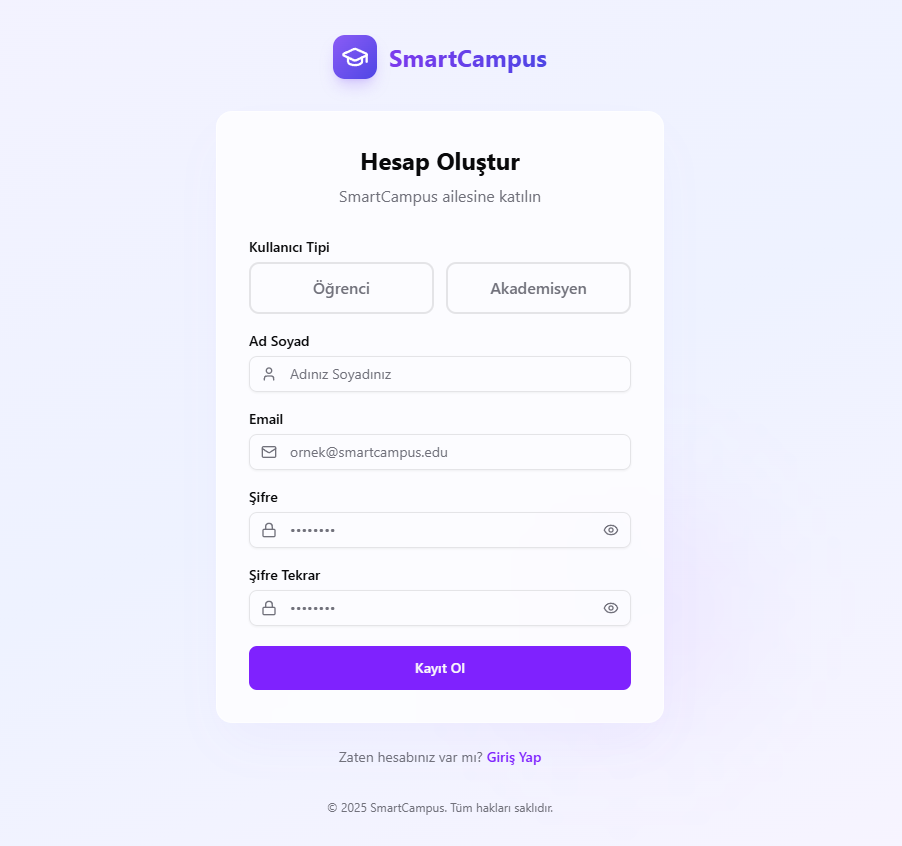
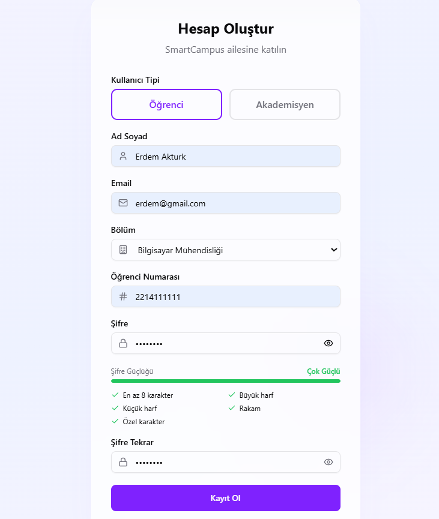
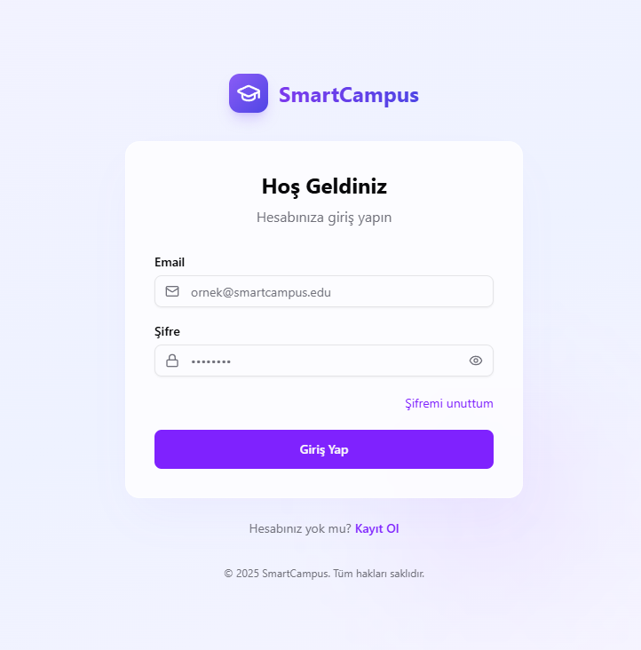
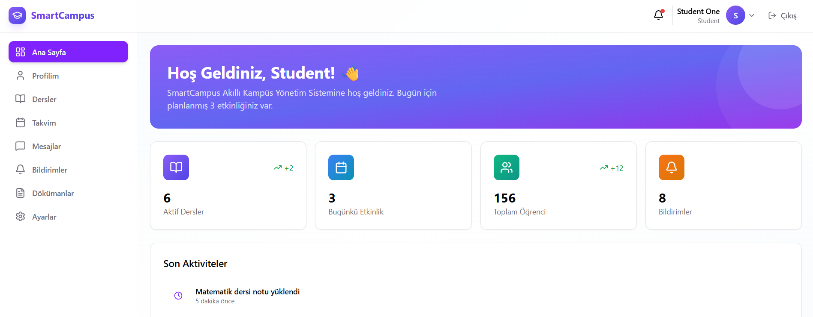
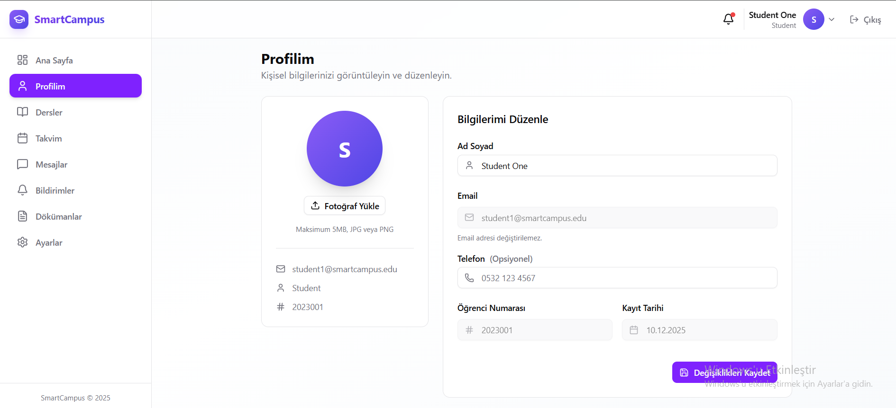

# 📖 Smart Campus - Kullanıcı Kılavuzu (Part 1)

## 🎯 Genel Bakış

Bu kılavuz, Smart Campus platformunu kullanmaya başlamak için gereken temel adımları açıklamaktadır. Kılavuz, kayıt olma, giriş yapma ve profil yönetimi işlemlerini kapsar.

---

## 1️⃣ Nasıl Kayıt Olunur?

### Adım 1: Kayıt Sayfasına Git

Ana sayfadan **"Kayıt Ol"** veya **"Register"** butonuna tıklayın.

> 📸 *Ekran görüntüsü: Ana sayfa - Kayıt Ol butonu*
> 
> 

---

### Adım 2: Kullanıcı Tipini Seçin

İki tip kullanıcı kaydı yapılabilir:

| Kullanıcı Tipi | Açıklama |
|:---------------|:---------|
| **Öğrenci (Student)** | Üniversite öğrencileri için |
| **Akademisyen (Faculty)** | Öğretim üyeleri ve görevliler için |

---

### Adım 3: Kayıt Formunu Doldurun

#### 🎓 Öğrenci Kaydı

| Alan | Açıklama | Örnek |
|:-----|:---------|:------|
| **E-posta** | Üniversite e-postanız | `ogrenci@smartcampus.edu` |
| **Şifre** | En az 8 karakter, büyük/küçük harf, rakam ve özel karakter | `Password123!` |
| **Şifre Tekrar** | Şifrenizi tekrar girin | `Password123!` |
| **Ad Soyad** | Tam adınız | `Ahmet Yılmaz` |
| **Öğrenci Numarası** | Öğrenci numaranız | `2023001` |
| **Bölüm** | Kayıtlı olduğunuz bölüm | `Bilgisayar Mühendisliği` |

> 📸 *Ekran görüntüsü: Öğrenci kayıt formu*
> 
> 

#### 👨‍🏫 Akademisyen Kaydı

| Alan | Açıklama | Örnek |
|:-----|:---------|:------|
| **E-posta** | Kurumsal e-postanız | `akademisyen@smartcampus.edu` |
| **Şifre** | En az 8 karakter | `Password123!` |
| **Şifre Tekrar** | Şifrenizi tekrar girin | `Password123!` |
| **Ad Soyad** | Tam adınız | `Dr. Mehmet Demir` |
| **Sicil Numarası** | Personel numaranız | `EMP001` |
| **Unvan** | Akademik unvanınız | `Dr.`, `Prof.`, `Doç.` |
| **Ofis Konumu** | Ofis numaranız | `A-101` |
| **Bölüm** | Görev yaptığınız bölüm | `Yazılım Mühendisliği` |

---

### Adım 4: Kayıt Ol Butonuna Tıklayın

Tüm alanları doldurduktan sonra **"Kayıt Ol"** butonuna tıklayın.

> ✅ **Başarılı Kayıt Mesajı:**
> *"Kayıt başarılı. Lütfen e-postanızı kontrol ederek hesabınızı doğrulayın."*

---

### Adım 5: E-posta Doğrulama

1. E-posta kutunuzu kontrol edin
2. Smart Campus'tan gelen doğrulama e-postasını açın
3. **"E-postamı Doğrula"** linkine tıklayın

> ⚠️ **Önemli:** E-posta doğrulaması yapılmadan sisteme giriş yapılamaz!

> 📸 *Ekran görüntüsü: Doğrulama e-postası*
> 
> 

---

## 2️⃣ Nasıl Giriş Yapılır?

### Adım 1: Giriş Sayfasına Git

Ana sayfadan **"Giriş Yap"** veya **"Login"** butonuna tıklayın.

> 📸 *Ekran görüntüsü: Giriş sayfası*
> 
> 

---

### Adım 2: Bilgilerinizi Girin

| Alan | Açıklama |
|:-----|:---------|
| **E-posta** | Kayıt olduğunuz e-posta adresi |
| **Şifre** | Belirlediğiniz şifre |

---

### Adım 3: Giriş Yap Butonuna Tıklayın

Bilgilerinizi girdikten sonra **"Giriş Yap"** butonuna tıklayın.

> ✅ **Başarılı Giriş:** Dashboard sayfasına yönlendirilirsiniz.

> 📸 *Ekran görüntüsü: Dashboard*
> 
> 

---

### 🔑 Şifremi Unuttum

Şifrenizi unuttuysanız:

1. Giriş sayfasında **"Şifremi Unuttum"** linkine tıklayın
2. E-posta adresinizi girin
3. **"Şifre Sıfırlama Linki Gönder"** butonuna tıklayın
4. E-postanıza gelen linke tıklayın
5. Yeni şifrenizi belirleyin

> 📸 *Ekran görüntüsü: Şifre sıfırlama*
> 
> 

---

## 3️⃣ Profil Nasıl Güncellenir?

### Adım 1: Profil Sayfasına Git

1. Sağ üst köşedeki profil ikonuna tıklayın
2. Açılan menüden **"Profilim"** seçeneğine tıklayın

> 📸 *Ekran görüntüsü: Profil menüsü*
> 
> 

---

### Adım 2: Bilgilerinizi Güncelleyin

Profil sayfasında aşağıdaki bilgileri güncelleyebilirsiniz:

| Alan | Güncellenebilir | Açıklama |
|:-----|:----------------|:---------|
| **Ad Soyad** | ✅ Evet | Tam adınızı değiştirebilirsiniz |
| **E-posta** | ✅ Evet | Yeni e-posta doğrulaması gerekebilir |
| **Telefon** | ✅ Evet | İletişim numaranız |
| **Profil Fotoğrafı** | ✅ Evet | JPG, PNG (Max 5MB) |
| **Öğrenci No / Sicil No** | ❌ Hayır | Değiştirilemez |
| **Bölüm** | ❌ Hayır | Admin onayı gerekir |

---

### Adım 3: Profil Fotoğrafı Yükleme

1. **"Fotoğraf Değiştir"** butonuna tıklayın
2. Bilgisayarınızdan bir fotoğraf seçin
3. **"Yükle"** butonuna tıklayın

> ⚠️ **Kısıtlamalar:**
> - Maksimum dosya boyutu: **5 MB**
> - İzin verilen formatlar: `.jpg`, `.jpeg`, `.png`

---

### Adım 4: Değişiklikleri Kaydet

Tüm güncellemeleri yaptıktan sonra **"Değişiklikleri Kaydet"** butonuna tıklayın.

> ✅ **Başarılı Güncelleme Mesajı:**
> *"Profiliniz başarıyla güncellendi."*

---

### 🔐 Şifre Değiştirme

Profil sayfasından şifrenizi değiştirmek için:

1. **"Şifre Değiştir"** sekmesine tıklayın
2. Mevcut şifrenizi girin
3. Yeni şifrenizi girin
4. Yeni şifrenizi tekrar girin
5. **"Şifreyi Değiştir"** butonuna tıklayın

| Alan | Açıklama |
|:-----|:---------|
| **Mevcut Şifre** | Şu an kullandığınız şifre |
| **Yeni Şifre** | En az 8 karakter, büyük/küçük harf, rakam, özel karakter |
| **Yeni Şifre (Tekrar)** | Yeni şifrenizi doğrulayın |

---

## ❓ Sık Sorulan Sorular (SSS)

### Kayıt ile ilgili

<strong>E-posta doğrulama linki gelmedi, ne yapmalıyım?</strong>

1. Spam/Gereksiz klasörünüzü kontrol edin
2. 5 dakika bekleyin, bazen gecikmeler olabilir
3. Giriş sayfasından "Doğrulama E-postasını Tekrar Gönder" seçeneğini kullanın

<strong>Kayıt olurken "Bu e-posta zaten kayıtlı" hatası alıyorum</strong>

Bu e-posta adresi ile daha önce kayıt yapılmış. "Şifremi Unuttum" özelliğini kullanarak hesabınıza erişebilirsiniz.

### Giriş ile ilgili

<strong>"Hesap aktif değil" hatası alıyorum</strong>

E-posta adresinizi henüz doğrulamamışsınız. E-posta kutunuzu kontrol edin ve doğrulama linkine tıklayın.

<strong>Şifre sıfırlama linki çalışmıyor</strong>

Şifre sıfırlama linkleri 24 saat geçerlidir. Süre dolmuşsa yeni bir link talep edin.

### Profil ile ilgili

<strong>Profil fotoğrafı yüklenmiyor</strong>

- Dosya boyutunun 5MB'ı geçmediğinden emin olun
- Sadece JPG, JPEG veya PNG formatları desteklenir
- Farklı bir tarayıcı deneyin

---

## 📞 Destek

Sorun yaşıyorsanız aşağıdaki kanallardan destek alabilirsiniz:

| Kanal | İletişim |
|:------|:---------|
| **E-posta** | support@smartcampus.edu |
| **Telefon** | +90 (XXX) XXX XX XX |
| **Çalışma Saatleri** | Pazartesi - Cuma, 09:00 - 18:00 |

---

## 📸 Ekran Görüntüleri Dizini

> ⚠️ **Not:** Ekran görüntüleri `docs/screenshots/` klasörüne yerleştirilmelidir.

| Dosya Adı | Açıklama |
|:----------|:---------|
| `register-page.png` | Kayıt sayfası genel görünüm |
| `student-register-form.png` | Öğrenci kayıt formu |
| `verification-email.png` | E-posta doğrulama mesajı |
| `login-page.png` | Giriş sayfası |
| `dashboard.png` | Ana dashboard |
| `forgot-password.png` | Şifremi unuttum sayfası |
| `profile-menu.png` | Profil menüsü |
| `profile-edit.png` | Profil düzenleme sayfası |
| `change-password.png` | Şifre değiştirme formu |
